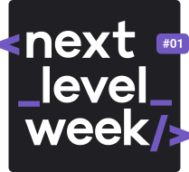
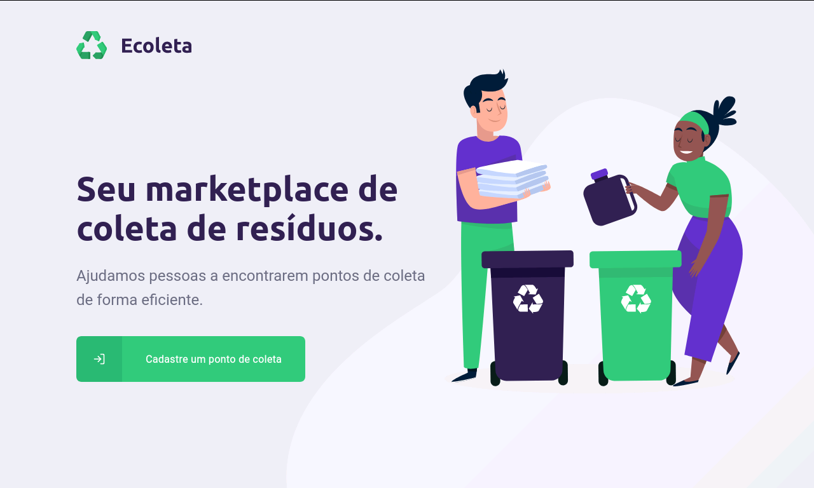
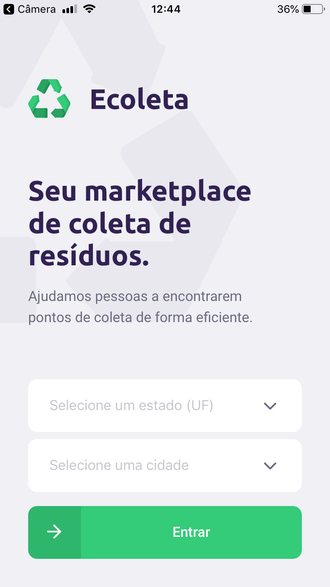

<h1 align="center">
    
</h1>

<h4 align="center"> 
	:construction: NextLevelWeek 1.0 🚀 In progress.. :construction:
</h4>
<p align="center">
  

  
	

  <a href="https://github.com/joel-fragoso/nlw-01.git">
    
  </a>

  
   <a href="hhttps://github.com/joel-fragoso/nlw-01.git">
    
  </a>
</p>
<p align="center">
<a href="https://github.com/joel-fragoso/nlw-01.git" target="_blank"></a>
</p>
<p align="center">
  <a href="#-nlw">Next Level Week</a>&nbsp;&nbsp;&nbsp;|&nbsp;&nbsp;&nbsp;
  <a href="#-project">Projeto</a>&nbsp;&nbsp;&nbsp;|&nbsp;&nbsp;&nbsp;
  <a href="#rocket-Technologies">Tecnologias</a>&nbsp;&nbsp;&nbsp;|&nbsp;&nbsp;&nbsp;
  <a href="#-layout">Layout</a>&nbsp;&nbsp;&nbsp;|&nbsp;&nbsp;&nbsp;
  <a href="#-how-to-use">Como usar</a>&nbsp;&nbsp;&nbsp;|&nbsp;&nbsp;&nbsp;
  <a href="#-how-to-contribute">Como contribuir</a>&nbsp;&nbsp;&nbsp;|&nbsp;&nbsp;&nbsp;
  <a href="#memo-license">Licença</a>
</p>

## :information_source: O que é o Next Level Week?

O NLW é uma semana prática com muito código, desafios, networking e um único objetivo: te levar para o próximo nível.

Através do nosso método você vai aprender novas ferramentas, conhecer novas tecnologias e descobrir hacks que vão impulsionar a sua carreira.

Um evento online e totalmente gratuito que vai te ajudar a dar o próximo passo na sua evolução como dev.

## 💻 Projeto

Ecoleta is a project developed based on international environment week. 
That aims to connect people to companies that collect specific waste such as light bulbs, batteries, cooking oil, etc.

<h1 align="center">
    
    
</h1>


## :rocket: Technologies

This project was developed with the following technologies:

- [Node.js][nodejs]
- [TypeScript][typescript]
- [React][reactjs]
- [React Native][rn]
- [Expo][expo]

## 🔖 Layout

To access the layout use [Figma](https://www.figma.com/file/1SxgOMojOB2zYT0Mdk28lB/).

## :information_source: How To Use

To clone and run this application, you'll need [Git](https://git-scm.com), [Node.js][nodejs] + [Yarn][yarn] installed on your computer.

From your command line:

### Install API 

```bash
# Clone this repository
$ git clone https://github.com/joel-fragoso/nlw-01.git

# Go into the repository
$ cd NLW-1.0/backend

# Install dependencies
$ yarn install

# Run Migrates
$ yarn knex:migrate

# Run Seeds
$ yarn knex:seed

# Start server
$ yarn dev

# running on port 3333
```

### Install Front-end

```bash
# Clone this repository
$ git clone https://github.com/joel-fragoso/nlw-01.git

# Go into the repository
$ cd NLW-1.0/frontent

# Install dependencies
$ yarn install

# Run
$ yarn start

# running on port 3000
```

### Install Mobile

```bash
# Clone this repository
$ git clone https://github.com/joel-fragoso/nlw-01.git

# Go into the repository
$ cd NLW-1.0/mobile

# Install dependencies
$ yarn install

# Run
$ yarn start

# Expo will open, just scan the qrcode on terminal or expo page

# If some problem with fonts, execute:
$ expo install expo-font @expo-google-fonts/ubuntu @expo-google-fonts/roboto

```

## 🤔 How to contribute

- Make a fork;
- Create a branck with your feature: `git checkout -b my-feature`;
- Commit changes: `git commit -m 'feat: My new feature'`;
- Make a push to your branch: `git push origin my-feature`.

After merging your receipt request to done, you can delete a branch from yours.

## :memo: License

This project is under the MIT license. See the [LICENSE](https://github.com/DanielObara/NLW-1.0/blob/master/LICENSE) for details.


Made with ♥ by Joel Fragoso :wave: [Get in touch!](https://github.com/joel-fragoso/nlw-01.git)

[nodejs]: https://nodejs.org/
[typescript]: https://www.typescriptlang.org/
[expo]: https://expo.io/
[reactjs]: https://reactjs.org
[rn]: https://facebook.github.io/react-native/
[yarn]: https://yarnpkg.com/
[vs]: https://code.visualstudio.com/
[vceditconfig]: https://marketplace.visualstudio.com/items?itemName=EditorConfig.EditorConfig
[vceslint]: https://marketplace.visualstudio.com/items?itemName=dbaeumer.vscode-eslint
[prettier]: https://marketplace.visualstudio.com/items?itemName=esbenp.prettier-vscode
